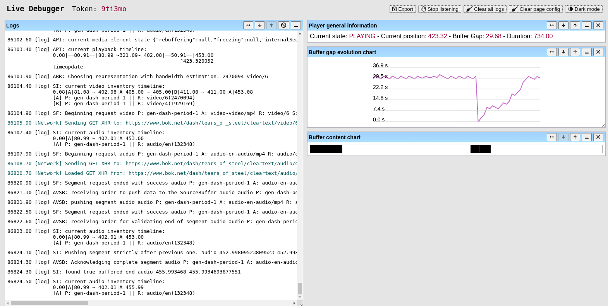

# RxPaired: RxPlayer's Able Inspector for REmote Debugging

This repository contains the RxPaired tool, a lightweight remote inspector adapted for
devices low on resources which displays supplementary indicators mostly useful when
using the [RxPlayer](https://github.com/canalplus/rx-player) library.



This project is functional and is regularly used at Canal+ for debugging media
applications relying on the RxPlayer.

Its key features are:

 - Minimal influence on the device's CPU and memory resources, when compared with
   Chrome's inspector and tools like weinre.

 - Ability to see in real time logs and useful playback indicators: which audio and
   video qualities are buffered at which point, information on network requests for
   media segments, evolution of the buffer's health etc.

 - Possibility to send JavaScript instructions to the device.

 - "Time travel": Possibility to see the known playback conditions and its related
   indicators at the time a log was sent, by clicking on its log on the inspector.

 - Possibility to store/export logs and inspect them later.


## Table Of Contents

  - [Quick start](#quick-start)
  - [What is it?](#what-is-it)
  - [How does it work?](#how-it-works)
  - [How to run it?](#how-to-run-it)
  - [Why creating this tool?](#why-creating-this-tool)

<a class="anchor" href="#quick-start"></a>
## Quick start

To quickly check if this tool can help you, you can start testing it by doing
the following:

  1. Clone this repository by running in a terminal:
     ```sh
     git clone https://github.com/peaBerberian/RxPaired.git
     cd RxPaired
     ```

  2. In a first terminal, you'll run the RxPaired server by running those commands at
     the root of the RxPaired repository:
     ```sh
     cd ./server
     npm install # install the RxPaired-server's dependencies
     npm run build # build the server
     node ./RxPaired-server --no-password # run it (no need of password for now)
     ```

  3. In a second terminal build both the client and inspector and serve them by
     running those commands at the root of the RxPaired repository:
     ```sh
     cd client
     npm install # install the RxPaired-client's dependencies
     cp .npmrc.sample .npmrc # set default config
     npm run build # build it
     cd ../inspector # Go back to the RxPaired-inspector now
     npm install # install the RxPaired-inspector's dependencies
     cp .npmrc.sample .npmrc # set default config
     npm run build # build it
     cd .. # Go back to the repository's root
     # Now serve them
     node utils/static_http_server.mjs --include-inspector-files --include-client-file
     ```

  4. Go to the inspector page which now should be at
     [http://127.0.0.1:8695](http://127.0.0.1:8695) and validate an empty password
     if the page asks for one.

  5. For our test, we will use the `example` token. Define it in the corresponding
     input and click on the button to use it now. You will be redirected to the
     inspector main page.

  6. In another browser tab, go to [the RxPlayer demo
     page](https://developers.canal-plus.com/rx-player/) (any page with the
     RxPlayer will do, but the `RxPlayer` JavaScript class - **not an
     instance** - needs to be accessible, see the script below).

     Open your browser's JavaScript console on that page and enter this code to
     dynamically link the inspector:
     ```js
     import("http://127.0.0.1:8695/client.js#example")
       .then(() => {
         window.__RX_INSPECTOR_RUN__({
           url: "http://127.0.0.1:8695/client.js#example",
           playerClass: RxPlayer, // For other pages: the RxPlayer class needs
                                  // to be accessible and communicated here
         });
         console.info("Inspector initialized with success!");
       })
       .catch((error) =>
         console.error("Failed to dynamically import inspector:", error)
       );
     ```

  7. Play a content in that page.

  8. Go back to the inspector page. You should now see logs and graphs about
     playback!

If you want to understand how it all works and how to use this in more complex
cases, keep reading below.

<a class="anchor" href="#what-is-it"></a>
## What is it?

RxPaired was first and foremost created to improve debugging and manual testing
sessions on resource-constrained devices using the RxPlayer.

It aims to redirect logs received on the tested device to a web page (generally loaded
on another device) while using the minimum possible resources on the tested device.

This web page also automatically exploits those logs to produce helpful graphs and
metrics about what's currently happening with the player: how much data is buffered, of
what audio and video quality etc.

You can also emit instructions JavaScript instructions from the webpage to the device, as
well as get responses back.

Yet, this tool was also written with modularity in mind. It should thus be very
easy to remove the RxPlayer "modules" from the web inspector of RxPaired, and replace
them by another logic, even for other usages than for media streaming.


<a class="anchor" href="#how-it-works"></a>
## How does it work?

RxPaired comes in three parts:

  1. The inspector web application, found in the `./inspector` directory.

     This is the page that will be used to inspect what's going on on the device remotely
     from a browser.
     This page can also send instructions directly to the device (only through the page's
     console for now, as the user interface for this is not yet developped).

     Under the hood, this inspector relies on a [WebSocket](https://en.wikipedia.org/wiki/WebSocket)
     connection with the  RxPaired's server to receive the device's source information
     (logs, requests etc.) and it contains some logic to construct graphical "modules"
     based on those logs: charts, curated information about playback etc.

     Note that multiple inspector pages can be created at the same time for multiple
     devices and multiple inspector pages can also be linked if they want to the same
     device. This is done through a system of "tokens", as explained in the inspector's
     main web page.

  2. A client-side script to deploy on the device, found in the `./client` directory.

     This script mostly [monkey-patches](https://en.wikipedia.org/wiki/Monkey_patch) console
     and request-related functions so any interaction with those is communicated with
     the RxPaired's server through a WebSocket connection.

     This script is also able to execute commands sent from the Inspector web-application
     (which goes through the exact same WebSocket connection).

     The client-side script has a minimal amount of processing logic to communicate those
     information, so we can limit the influence on the device's performance. A single
     long-lived WebSocket connection is also used instead of multiple HTTP calls for those
     same considerations.

  3. The server, written in the `./server` directory, on which the two precedent parts
     rely.

     The server listens on two ports for WebSocket connections: one for the inspector and
     the other for the client-side script.

     The server is very configurable: it can for example set-up a password to protect its
     access, shutdown when abnormal behavior is detected (like too many device or
     inspector connections, too many wrong password, too many WebSocket messages sent),
     create and keep log files for each inspected devices, give a maximum lifetime for
     each token, change the ports it listens to etc.

<a class="anchor" href="#how-to-run-it"></a>
## How to run it?

To run RxPaired you have to:
  1. start RxPaired-server in `./server` with the wanted options
  2. build and optionally serve the RxPaired-client script that will be put on the device
     (instructions and files in `./client`)
  3. build and serve the RxPaired-inspector web page (instructions and files in
     `./inspector`).

You can look at how to do just that by looking at the `README.md` file of each of those
subdirectories.

You can run the server and client on your own PC or on a server.
If you want to use HTTPS / WSS, which might be required on HTTPS applications, you'll need
to perform HTTPS tunnelling to that server. This can either be performed through softwares
like Apache or Nginx through configuration or by using a tunnelling tool like
[`ngrok`](https://ngrok.com/).


<a class="anchor" href="#why-creating-this-tool"></a>
## Why creating this tool?

The RxPlayer is an advanced media player which is used to play contents on a large panel
of devices. Like for most software, we sometimes need to start debugging sessions on one
of those, e.g., to investigate curious behavior.

As a player for the web platform, the RxPlayer can often profit from already available
remote web inspectors to do just that from our PC. Most notably, the featureful Chrome
remote debugger is a complete tool that is most often available.
In cases where it isn't, [weinre](https://people.apache.org/~pmuellr/weinre/docs/latest/Home.html)
was also a very useful tool in the past.

However those tools have limitations on some devices.
The one that hindered us the most, is that those tools often use a lot of resources:
we're sometimes not even able to use the Chrome Remote Debugger for more than a minute on
some targets with low memory (smart TVs, set-top boxes, ChromeCast...) and even in the
time window where we can, the resource usage those tools take might provoke large
side-effects and is a very frequent source of [heisenbug](https://en.wikipedia.org/wiki/Heisenbug)
for our team.

When what we wanted to do was just to recuperate logs from the device, this became very
annoying.

After initial even-lighter tools like a simple HTTP, then
[WebSocket-based](https://gist.github.com/peaBerberian/5471f397b6dd3682bc5980d11cfc4421) 
log server, we noticed that we could do even better in terms of usability and usefulness
than a simple log server: our own remote inspector tool, whose core goal would be
lightweightness and, why not, also have the advantage of being specialized for the
debugging of the RxPlayer.

Enter RxPaired: The **RxP**layer's **A**ble **I**nspector for **Re**mote **D**ebugging
