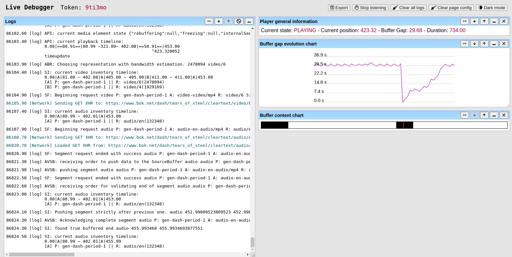

# RxPaired: RxPlayer's Lightweight Remote Inspector

This repository contains the RxPaired tool, a lightweight remote inspector with indicators
mostly useful when using the [RxPlayer](https://github.com/canalplus/rx-player) library.

This project is functional and already-used but is still a Work-in-Progress.

# Why?

The RxPlayer is an advanced media player which is used to play contents on a large panel
of devices. Like for most software, we sometimes need to start debugging sessions on one
of those, e.g., to investivate curious behavior.

As a player for the web platform, the RxPlayer can often profit from already available
remote web inspector to do just that from our PC. Most notably, a featureful Chrome remote
debugger is a complete tool that is most often available.
In cases where it isn't, [weinre](https://people.apache.org/~pmuellr/weinre/docs/latest/Home.html)
is also a very useful tool.

However those tools have limitations on some devices.
The one that hindered us the most, is that those tools often use a lot of resources:
we're sometimes not even able to use the Chrome Remote Debugger for more than a minute on
some extreme targets (smart TVs, set-top boxes, ChromeCast...) and even in the time window
where we can, the resource usage those tools take might provoke large side-effects and is
a very frequent source of [heisenbug](https://en.wikipedia.org/wiki/Heisenbug) for our team.

When what we want to do was just to recuperate logs from the device, this is very
annoying.

After initial even-lighter tools like a simple HTTP, then
[WebSocket-based](https://gist.github.com/peaBerberian/5471f397b6dd3682bc5980d11cfc4421) 
log server, we noticed that we could do even better in terms of usability and usefulness
than a simple log server: our own remote inspector tool, whose core goal would be
lightweightness and which could even have the advantage of being specialized for the
debugging of the RxPlayer.

Enter RxPaired: The **RxP**layer's **A**ble **I**nspector for **Re**mote **D**ebugging

# How?

RxPaired actually comes in three parts:

  1. The inspector web application, found in the `./inspector`.

     This is the page that will be used to actually inspect what's going on on the device
     remotely from your browser.

     Under the hood, this inspector relies on a WebSocket connection with the RxPaired's
     server to receive the device's source information (logs, requests etc.) and contains
     some logic analysing those logs to construct graphical "modules": charts, curated
     information about playback etc.

     Note that multiple inspector pages can be created at the same time for multiple
     devices through a system of "tokens".

  2. A client-side script to deploy on the device, found in the `./client` directory.

     This script mostly [monkey-patch](https://en.wikipedia.org/wiki/Monkey_patch) console
     functions and request-related functions so any interaction with those is also sent
     through the RxPaired's server through a [WebSocket](https://en.wikipedia.org/wiki/WebSocket)
     connection with RxPaired's server.

     This script is also able to execute command sent from the Inspector coming from the
     same connection.

     The client-side script has a minimal amount of processing logic to communicate those
     information, so we can limit the influence on the device's performance. A single
     long-lived WebSocket connection is also used instead of multiple HTTP calls for those
     same considerations.

  3. The server, written in the `./server` directory, on which the two precedent parts
     rely.

     The server listens on two ports for WebSocket connections: one for the inspector and
     the other for the client-side script.

     The server also allows configuration to for example shutdown when abnormal behavior
     (such as too many device connections, inspector connections or messages) is detected,
     to create and keep log files for each inspected devices etc.
